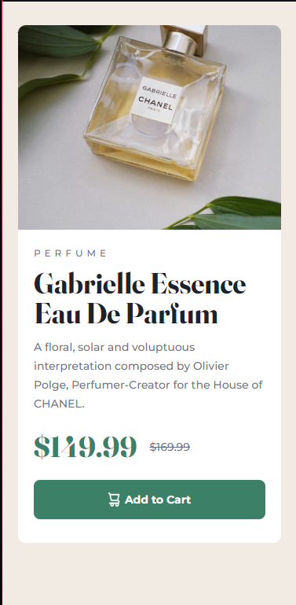
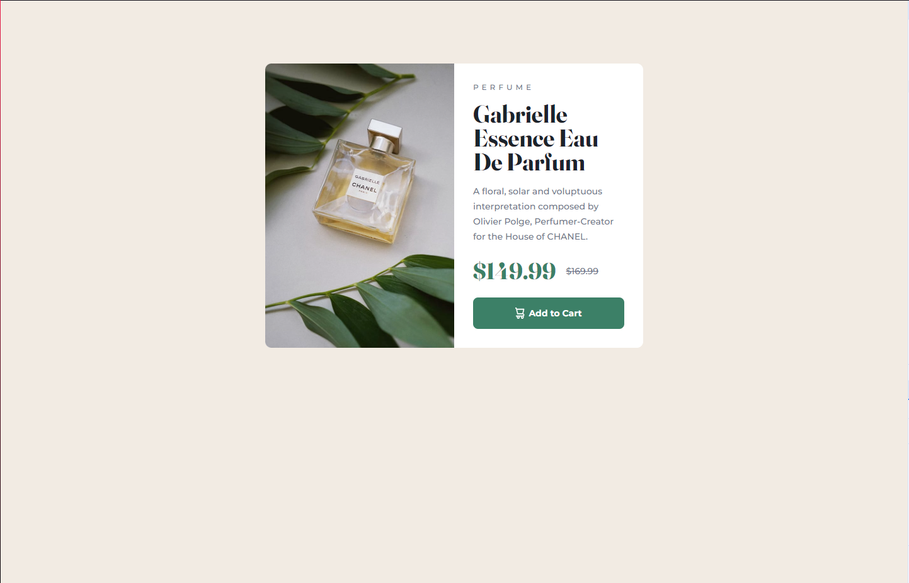

## Table of contents

- [Overview](#overview)
  - [The challenge](#the-challenge)
  - [Screenshot](#screenshot)
  - [Links](#links)
- [My process](#my-process)
  - [Built with](#built-with)
- [Author](#author)

## Overview

This is a responsive preview card component. Here I practice using Flex media queries and HTML semantic.

### The challenge

Users should be able to:

- View the optimal layout depending on their device's screen size
- See hover and focus states for interactive elements

### Screenshot

### Links

- Solution URL: [Github](https://your-solution-url.com)
- Live Site URL: [Netlify](https://idyllic-pixie-1204df.netlify.app)

## My process

### Built with

- Semantic HTML5 markup
- CSS custom properties
- Flexbox
- Mobile-first workflow

## Author

- Github - [Github](https://github.com/forneiro)
- Frontend Mentor - [@forneiro](https://www.frontendmentor.io/profile/forneiro)
